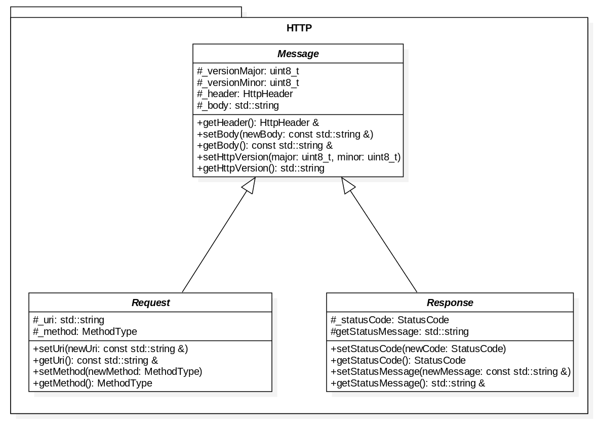
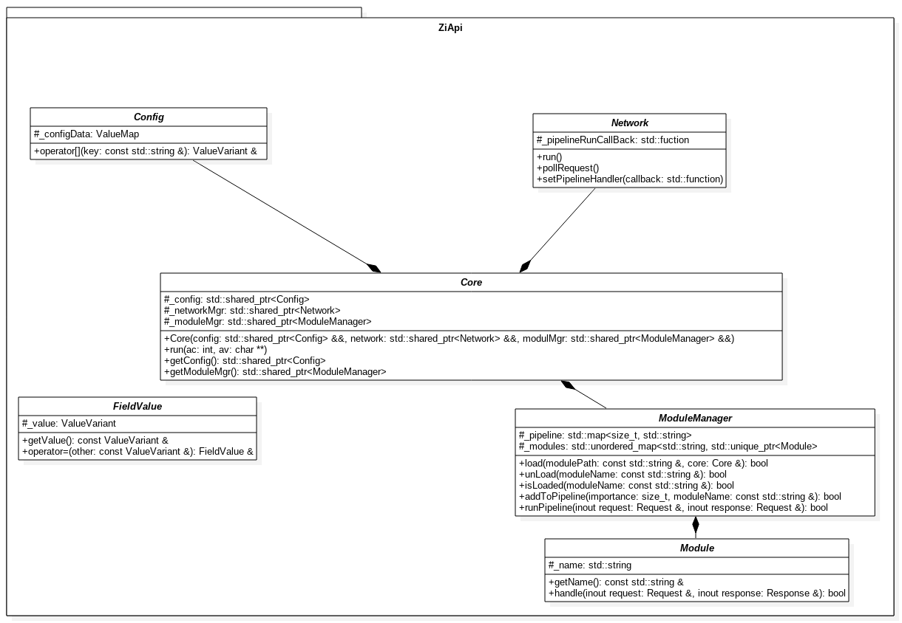

ZiApi

API for Zia Epitech 2021

## Contact

If you have questions regarding the library, I would like to invite you to [open an issue at GitHub](https://github.com/KillianG/ZiApi/issues/new). Please describe your request, problem, or question as detailed as possible. Opening an issue at GitHub allows other users and contributors to this library to collaborate. If you have a look at the [closed issues](https://github.com/KillianG/ZiApi/issues?q=is%3Aissue+is%3Aclosed), you will see that we react quite timely in most cases.

Only if your request would contain confidential information, please [send us an email](mailto:nathan@lebon.epitech.eu).

**How to add ZiApi to your project :**

```bash
git clone git@github.com:KillianG/ZiApi.git
```
**How to use ZiApi in your project :**

```cmake
add_subdirectory(ZiApi/)
```

​


```html
<div id="list">
  <p><iframe src="LICENSE" frameborder="0" height="400"
      width="95%"></iframe></p>
</div>
```

